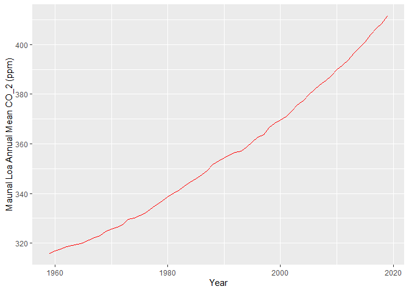

Case Study 08
================
Kaiser Mahmood
August 1, 2020

``` r
library(tidyverse)
library(kableExtra)
library(ggplot2)
library(knitr)
library(magick)

library(dplyr)
```

<!-- -->

| year |   mean |
| ---: | -----: |
| 2019 | 411.43 |
| 2018 | 408.52 |
| 2017 | 406.55 |
| 2016 | 404.22 |
| 2015 | 400.83 |
